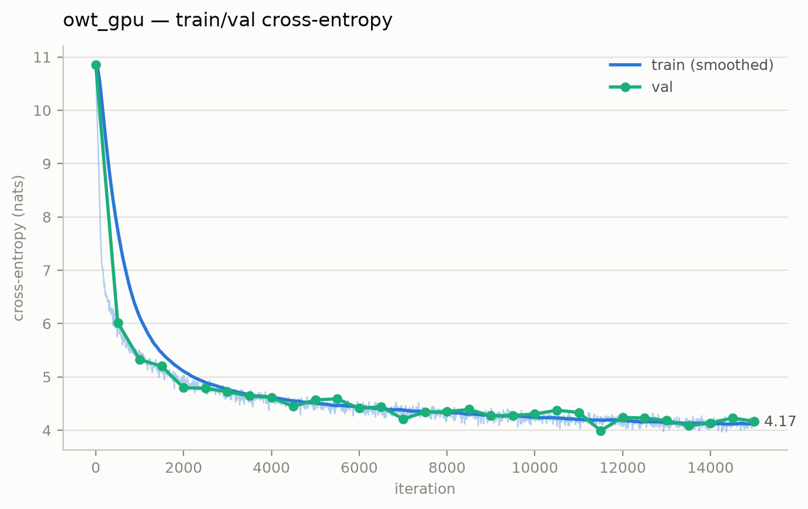
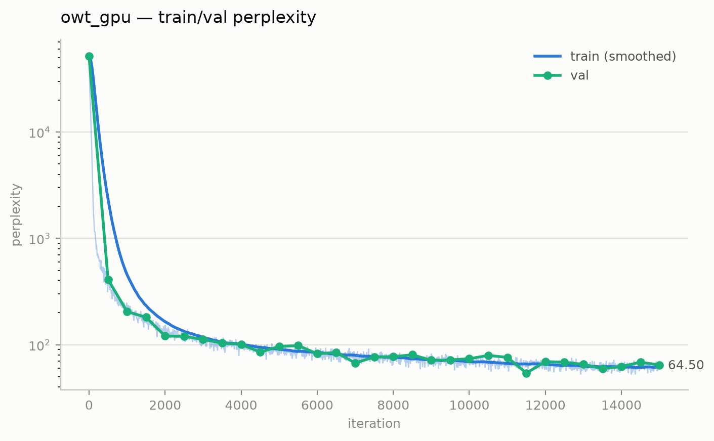

# GPT-2 from scratch — no torch/jax autograd

Rumik Polaris fellowship assignment: a GPT-2 style decoder-only transformer,
trained on an OpenWebText subset, with a hand-written numpy autograd engine.
All gradients derived by hand — see [DERIVATIONS.md](DERIVATIONS.md).
Roadblocks and process: [JOURNAL.md](JOURNAL.md).

Approach 2 was chosen, verbatim: `write your own auto-grad which supports tensors and enough functions to automate the backward pass of GPT-2.`

This was done to satisfy the assignment criteria, and to help the evaluators assess the work 
as per requirements.

## Approach

The brief allowed either hand-deriving every gradient or writing a small tensor
autograd, so I did both:
each vector–Jacobian product is derived and summarized in [DERIVATIONS.md](DERIVATIONS.md), and 
the engine runs the same rules for the most part, so every gradient in the code maps back to the math.

**From micrograd to tensors.** 
The design starts from the scalar `Value` autograd in Karpathy's zero-to-hero, which 
is demonstrated in the warmup notebooks:
a value carries a `_backward` closure, `backward()` topologically sorts the graph 
and runs the closures in reverse, and a value used more than once accumulates its
gradient. 
This skeleton is the core of the whole architecture, and generalizing it from
scalars to numpy arrays needs only three additions: the broadcasting gradient rule
(un-sum back to the input shape, #1), matmul (#2), and the reduction/gather ops
(#3–#8).

**The engine ([engine/tensor.py](engine/tensor.py)).** 
A `Tensor` wraps an `ndarray`; every op returns a new `Tensor` whose `_backward` 
pushes a gradient to its inputs — a vector–Jacobian product, never a materialized 
Jacobian. 
`backward()` seeds the loss with 1, topologically sorts the ~1,500-node graph, runs 
the closures newest-first, and frees each intermediate's gradient the moment its 
closure has run (this roughly halved peak GPU memory).

**What is fused:**
Add, mul, matmul, sum, mean, reshape, transpose, slice
and exp/log/tanh are primitives, and **LayerNorm is composed from them** so its
`backward` falls out of the chain rule with no new derivation (#9). Four operations are
instead fused: `softmax_cross_entropy` — the −y/p term cancels analytically against
p, and composing it would materialize a (B·T, 50257) probability tensor and carry
~50,000-magnitude intermediates (#8) — plus `gelu`, `softmax`, and `embedding`,
whose `backward` must scatter-**add** because a repeated token id is a fan-out (#5).

**Compute constraints:** 
The backend swaps numpy for CuPy with a single call, so the
same code runs on CPU or GPU. Training used an **RTX 3050 Laptop (4 GB)**, and the
4 GB was the one real constraint: the tied-head logits are a (B·T, 50257) tensor.
The answer was microbatch 2 × grad-accum 32 with the CuPy pool capped at 3 GB,
since past ~3 GB the driver silently pages to system RAM (~20× slower), so the 
cap makes an overflow fail loudly instead of paging quietly. 
This setting held ~4.3K tok/s across the full 245M-token run; a pure-numpy CPU path is the
documented fallback.

### Design choices — what and why

| choice                                              | instead of                         | why                                                                                                                                                                                                                                                                                    |
| --------------------------------------------------- | ---------------------------------- | -------------------------------------------------------------------------------------------------------------------------------------------------------------------------------------------------------------------------------------------------------------------------------------- |
| LayerNorm                                           | BatchNorm                          | - normalizes per position over channels — no cross-example coupling (batch statistics are poor when `microbatch 2`)<br>- no running stats or train-evaluation mode required<br>- biased 1/C variance per GPT-2. Derivation #9; the fused BN backward hand-verified in warmups/04. |
| GELU (tanh approximation)                           | tanh / ReLU                        | GPT-2's activation function<br>functionally smooth with nonzero gradient for small negatives. Derivative derived in #6, fused in the engine for memory.                                                                                                                                |
| learned positional embeddings (wpe)                 | nothing (MLP warmup needed none)   | - attention is permutation-invariant — the fixed-window MLP got position free from its concat slots<br>- a transformer must inject it explicitly                                                                                                                                            |
| causal self-attention                               | fixed-window concat (makemore MLP) | - every position attends over all previous ones instead of a hard 3-token window<br>- mask is −1e9, finite, because −inf breeds NaN in the softmax backward (#11)                                                                                                                           |
| pre-norm residual blocks                            | plain stacked layers               | - the identity path keeps gradients alive through depth<br>- a residual add is a fan-out, handled by the engine's `+=` accumulation rule (#1)                                                                                                                                               |
| weight tying (wte = LM head)                        | separate output matrix             | - halves embedding parameters<br>- the two gradient paths sum automatically at fan-out — no special code                                                                                                                                                                                    |
| AdamW + warmup/cosine + clipping                    | SGD + step decay (my warmups)      | - per-parameter step scaling across embeddings vs matrices<br>- bias correction derived in #10<br>- decoupled decay on 2D params only (decaying LN gains fights the normalization)<br>- warmup + clipping for stability at lr 6e-4                                                                  |
| init std 0.02, residual projections ×1/√(2·n_layer) | gain-based Kaiming (my warmups)    | - controls variance growth along the residual stream with depth (GPT-2's scheme), rather than per-layer variance preservation                                                                                                                                                            |
| fused softmax-CE, GELU, softmax, embedding          | composing from primitives          | - the analytic cancellation (−y/p against p) done on paper once, exactly<br>- the composed backward is numerically noisy and memory-hungry at V=50257 (#8)                                                                                                                                 |

## Model & training

| | |
|---|---|
| Architecture | 6 layers · 6 heads · 384 d_model · 256 context |
| Vocabulary | 50,257 (GPT-2 BPE, tiktoken) |
| Parameters | 30.0M (token embedding tied to the LM head) |
| Optimizer | AdamW, β=(0.9, 0.95), weight decay 0.1 on 2-D params, grad-clip 1.0 |
| LR schedule | 500-step warmup → cosine, 6e-4 → 6e-5 |
| Batch | microbatch 2 × grad-accum 32 = 16,384 tokens/step |
| Training | 15,000 iters · 245.7M tokens · dropout 0.0 |
| Hardware | RTX 3050 Laptop 4 GB via CuPy · ~4.3K tok/s · ~14.7 h |

## Results

**Model:** 30.0M parameters (6 layers, 6 heads, 384 embd, block 256), trained from
scratch on a 245M-token OpenWebText subset. That is ~1/4 the parameters and ~1/40
the training tokens of GPT-2 124M (WebText, ~10B tokens). It underfits by design
(see SPRINT.md / JOURNAL.md).

Final training loss 4.18; **full validation perplexity 63.0** (nll 4.1433 over the
entire 1.12M-token OWT val set — the noisy 20-block training estimator read 64.5).




Downstream zero-shot evals (forward-only; simplifications documented in
`scripts/eval_lm.py` and `scripts/full_val.py`):

| eval | this model (30M, 245M tok) | GPT-2 124M (paper) |
|---|---|---|
| OWT val ppl (full set) | 63.0 | — |
| WikiText-2 ppl | 203.9 | 29.41 |
| LAMBADA acc (500 ex) | 7.8% | 45.99% |

The two downstream numbers sit far from GPT-2 124M — expected at 1/4 the params,
1/40 the tokens, and (for WikiText-2) a corpus now out of the training distribution.
On LAMBADA it lands well above chance, so it learns real last-word prediction, but only weakly.

### Sample generations

`python run.py sample out/owt_gpu/ckpt.npz --prompt "..."` (temperature 0.8, top-k 200):

> **Once upon a time, there was a** slight number of references for the first time.
> However, the whole thing is no longer a mystery, even if the image was left to be
> restored to the same conclusion. [...]

> **On a quiet morning in the mountains,** my friend tried to explain the state of it
> on a single drive. I was hoping the mine was the home of an old farm worker who was
> an outsider and eventually moved to a different town. He was in my own home. He was
> trying to get to the same town. I wanted to take a home in the town.

Coherent within a sentence, but drifting is evident after one or two sentences. This is the typical small-model behaviour, traced in JOURNAL.md.

## How to run

```
pip install -r requirements.txt                  # numpy training path; no torch/jax
python run.py prep-shakespeare                   # sanity dataset (seconds)
python run.py prep-owt --max-tokens 250000000    # 248.9M train / 1.12M val
python tests/test_ops.py                         # gradient checks, every op
python run.py train shakespeare_char             # sanity run
python run.py train owt_gpu                      # main run (owt_cpu for CPU fallback)
python run.py sample out/owt_gpu/ckpt.npz --prompt "Once upon a time, there was a"
python run.py eval out/owt_gpu/ckpt.npz --task wikitext2
```

## Repository structure

```
run.py             # single entry point: python run.py <command> [args]
engine/tensor.py   # the numpy autograd engine — every VJP (see DERIVATIONS.md)
model.py           # GPT-2 assembled from engine ops
optim.py           # AdamW + warmup/cosine LR + gradient clipping
config.py          # training presets (overfit / shakespeare / owt_cpu / owt_gpu)
checkpoint.py      # positional .npz save/load
scripts/           # train · sample · status · watchdog · eval_lm · full_val ·
                   #   make_plots · prepare_shakespeare · prepare_openwebtext
tests/             # 25 gradient checks + full-model finite-difference probe
notebooks/         # warmups (micrograd → backprop-ninja) + course/
data/ · plots/ · out/    # tokenized bins · figures · checkpoints & logs
```

Per-file, per-function breakdown: [CODEMAP.md](CODEMAP.md).

## Tests

Every engine op is gradient-checked against central finite differences (float64):

```
python tests/test_ops.py     # 25/25 op VJPs: broadcast, repeated-index, weight-tying, …
python tests/test_model.py   # init loss ≈ ln(V), then finite-diff probe of every parameter
```

## AI use disclosure

The math and the design are mine: every gradient is derived by hand
([DERIVATIONS.md](DERIVATIONS.md)), and the architecture choices are laid out and
defended in the **Approach** section above. Under a compressed deadline I had
**Claude (Opus 4.8)** build the pipeline surrounding my tensor engine.
All code is based on these derivations: the autograd engine, GPT-2 model, 
and AdamW optimizer, plus the plumbing (data prep, training loop, evals, plots, 
tests).